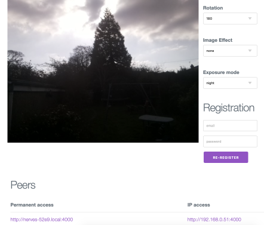

# Getting started

This ought to go up in the app at some point, but here's how to get started.

## Get the kit.

You'll need:

* a Micro SD card reader (for writing to the SD card, but they're just called readers for some reason)
* A Pi Zero W, eg [here](https://shop.pimoroni.com/products/raspberry-pi-zero-w)
* A Pi Camera. [These](https://shop.pimoroni.com/products/raspberry-pi-zero-camera-module) are fine. (If you get a [standard Pi camera](https://shop.pimoroni.com/products/raspberry-pi-camera-module-v2-1-with-mount) then you will also need an adapter like this https://shop.pimoroni.com/products/camera-cable-raspberry-pi-zero-edition.)
* A 4GB or larger micro SD card
* Power (any USB charger, really) and a micro usb cable.

Assembly I will leave as an exercise for the reader.

## Grab the firmware image

They're in the releases [here](https://github.com/paulanthonywilson/mcam/releases). Download the latest one, which is not the source code - the extension is `img.tar.gz`

It's compressed, so uncompress it. You can do this on a Mac by double clicking the file in finder.

## 🔥 Burn the image to the SD card 🔥

On OS X and Linux (at least) you can use [DD](https://www.man7.org/linux/man-pages/man1/dd.1.html), see http://furlough.merecomplexities.com/pi/2020/11/14/video-calling-with-a-raspberry-pi-4.html. 

It is faster and easier to use the [Raspberry Pi Imaging tool](https://www.raspberrypi.org/software/), though. For the Operating System choose the last option "Use custom" and select the image file that you have downloaded, and burn away. 

## Connect to your WiFi

Insert the SD card, and make sure everything else is set up on the Pi (power and camera). Power on and let it boot. Give it a minute and you should see a new WiFi network appear. It will be of the form `nerves-xxxx` where `xxxx` is a 4 digit hexadecimal number, eg `nerves-52e9`. 

Connect to that WiFi network and point your browser to http://192.168.0.1. This will take you to the [VintageNet Wizard](https://hexdocs.pm/vintage_net_wizard/readme.html) Wifi set up. Select your Wifi and enter your password. Select "Apply Configuration" on the next page and continue following the instructions.

If you lose the `nerves-xxx` wifi hotspot, and it does not reappear then it is probable that the setup was successful anyway. Give it some time and continue to the next step.

If your WiFi configurration changes or it's just not working, then you can restart the WiFi configuration can be done in two ways:

* Re-image the SD card
* Connect the 3V power out on the PI to GPIO "pin" 17 for 5 seconds. You can do this with some wire, even if you have not soldered headers.  The 3V pin is the square hole on the very top left of the GPIO pins/holes, with the top being that closest to SD card. GPIO 17 is the 6th pin\hole down on that left hand side, counting the 3V pin\hole as the first.

## Browse to the camera on the local network

Once you're all setup with WiFi you should be able to connect to http://merecam.local:4000. (It might take a minute or two to be up and running).You should get a streamed image, some camera configuration options, a status at the top saying "unregistered" and a registration form. If you have more than one Pi Zero on your network running the firmware then - nice!. Also you should see a list of links to enable you to navigate those cameras beneath the image displayed, both by local network domain name and by IP address.  

## Register at Mere Cam

Go to https://mcam.iscodebaseonfire.com and register for an account. Once you've confirmed your email you should get a page saying you've no cameras.

Go back to your local camera page at  http://merecam.local:400 (or more specific url). Use your same registration details (username and password) to register your camera to your account.

Now your camera should appear on https://mcam.iscodebaseonfire.com, and you're done. 😅

